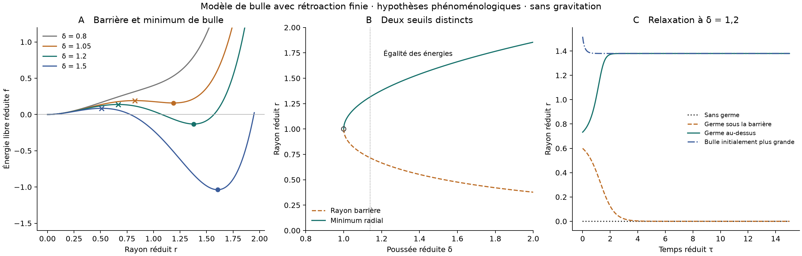

# Résultats du modèle de bulle

Unités réduites, rétroaction postulée ; aucune identification au plasma QCD.

| δ | Rayon barrière | Rayon bulle | f barrière | f bulle | État |
|---:|---:|---:|---:|---:|---|
| 0.800000 | — | — | — | — | aucun équilibre de rayon positif |
| 1.000000 | 1.000000 | 1.000000 | 0.222222 | 0.222222 | point dégénéré sans minimum |
| 1.050000 | 0.824106 | 1.187083 | 0.191577 | 0.158805 | minimum local de bulle défavorisé face à R=0 |
| 1.139754 | 0.715535 | 1.316074 | 0.155751 | 0.000000 | égalité des deux minima de cette famille |
| 1.200000 | 0.665984 | 1.379520 | 0.138150 | -0.131459 | minimum de bulle favorisé face à R=0 |
| 1.500000 | 0.511400 | 1.604439 | 0.085189 | -1.037308 | minimum de bulle favorisé face à R=0 |
| 2.000000 | 0.377540 | 1.854963 | 0.047190 | -3.379602 | minimum de bulle favorisé face à R=0 |

À δ = 1, le rayon affiché est un point stationnaire dégénéré, sans minimum local.
La barrière depuis r = 0 reste positive pour tout δ fini. Les minima sont comparés dans la seule famille sphérique définie.

## Accessibilité sous accumulation

q(t) = (I/γ)(1 − exp(−γt)), γ = 0,2 ; δ = 0,8 + q. Calcul avant nucléation à volume de nuage fixé.

| I | δ plafond | Temps δ = 1 | Temps égalité des énergies |
|---:|---:|---:|---:|
| 0.030000 | 0.950000 | — | — |
| 0.040000 | 1.000000 | — | — |
| 0.050000 | 1.050000 | 8.047190 | — |
| 0.070000 | 1.150000 | 4.236489 | 17.654999 |
| 0.140000 | 1.500000 | 1.682361 | 3.321459 |

Un tiret indique une absence d’atteinte à temps fini. Aucun de ces temps ne calcule la nucléation.

## Relaxations à δ fixé

| Préparation | Rayon initial | Rayon final à τ = 60 |
|---|---:|---:|
| sans_germe | 0.000000 | 0.000000 |
| sous_barriere | 0.599386 | 0.000000 |
| au_dessus_barriere | 0.732582 | 1.379520 |
| bulle_plus_grande | 1.517472 | 1.379520 |

## Sensibilité à tension variable

Poussée dimensionnée réduite fixée à 3,2 ; K = 100 et Vréservoir = 200π.

| σ | δ correspondant | Rayon minimum dimensionné réduit |
|---:|---:|---:|
| 0.500000 | 2.018151 | 1.566260 |
| 1.000000 | 1.200000 | 1.379520 |
| 2.000000 | 0.713524 | — |

## Vérifications

- racines_et_courbures : erreur 1.78e-15, tolérance 1e-11.
- seuil_degenere : erreur 4.44e-16, tolérance 1e-12.
- absence_minimum_au_seuil : erreur 0, tolérance 0.
- coexistence_analytique : erreur 1.11e-16, tolérance 1e-12.
- reduction_dimensionnelle : erreur 3.55e-15, tolérance 1e-12.
- gradient_par_differences_finies : erreur 1.27e-09, tolérance 1e-07.
- balance_mecanique : erreur 8.88e-16, tolérance 1e-11.
- convergence_RK4_pas_divise_par_deux : erreur 9.66e-09, tolérance 1e-07.
- dissipation_energie_parametres_fixes : erreur 9.99e-16, tolérance 1e-12.
- deux_bassins_attraction : erreur 2e-15, tolérance 1e-10.
- absence_creation_deterministe_depuis_zero : erreur 0, tolérance 0.
- temps_atteinte_solution_exacte : erreur 8.33e-17, tolérance 1e-12.
- contre_cas_sans_retroaction : erreur 0, tolérance 1e-12.
- fraction_convertie_inferieure_5_pourcent : erreur 0, tolérance 0.

Reproduction : `python3 calcul_bulle.py`. Ajouter `--plot` avec Matplotlib pour les figures.

