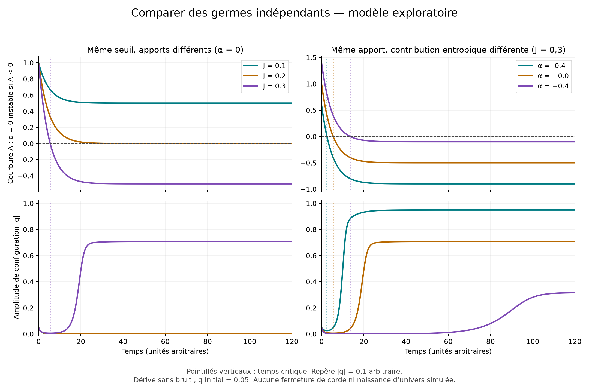

# Comparaison de neuf germes indépendants

Simulation exploratoire, sans données observées ni calibration cosmologique.

## Protocole

On croise J = 0,1 ; 0,2 ; 0,3 avec alpha = −0,4 ; 0 ; +0,4. Chaque germe a k = g = b = mobilité = 1, N = 10 modes internes, k_B T = 0,1, n initial = 0, q initial = 0,05 et un taux de perte lambda = 0,2. Durée : 120 ; pas RK4 : 0,01 ; unités arbitraires.

Lois : dn/dt = J − lambda n ; A = k − g n + N alpha k_B T ; dq/dt = −mobilité × (A q + b q³). La solution analytique de n(t) alimente le calcul de q.

Le temps critique correspond à A = 0. Le minimum quartique est encore stable à cet instant ; q = 0 devient instable pour A < 0. Le repère |q| = 0,1 indique seulement une amplitude lisible : il ne définit aucune fermeture, particule ou naissance d’univers.

## Résultats

| alpha | J | plafond n | seuil n | temps critique | temps à amplitude 0,1 | délai après seuil |
|---:|---:|---:|---:|---:|---:|---:|
| -0.4 | 0.1 | 0.50 | 0.60 | — | — | — |
| -0.4 | 0.2 | 1.00 | 0.60 | 4.581 | 13.431 | 8.849 |
| -0.4 | 0.3 | 1.50 | 0.60 | 2.554 | 7.108 | 4.553 |
| +0.0 | 0.1 | 0.50 | 1.00 | — | — | — |
| +0.0 | 0.2 | 1.00 | 1.00 | — | — | — |
| +0.0 | 0.3 | 1.50 | 1.00 | 5.493 | 15.774 | 10.281 |
| +0.4 | 0.1 | 0.50 | 1.40 | — | — | — |
| +0.4 | 0.2 | 1.00 | 1.40 | — | — | — |
| +0.4 | 0.3 | 1.50 | 1.40 | 13.540 | 82.468 | 68.928 |

Un tiret dans « temps critique » signifie que le seuil ne peut pas être dépassé en temps fini sous ces apports constants. Un tiret dans « temps à amplitude » signifie que ce passage montant n’a pas été observé pendant les 120 unités simulées.

## Interprétation et limites

- À alpha fixé, les apports changent l’accessibilité et le temps du seuil, sans changer sa valeur.
- À J fixé, alpha change la contribution entropique et donc le seuil. Cela compare des lois de couplage différentes, pas une mesure de « quantité d’information accumulée ».
- Le retard de croissance dépend de la dynamique, du germe initial q et du repère choisi. q diminue avant le seuil ; son amplification ultérieure peut prendre du temps.
- Si q initial vaut exactement zéro, il reste nul dans cette équation sans bruit, même après la perte de stabilité. La perturbation initiale est donc explicite. À température finie, une simulation de trajectoires thermiques demanderait aussi un bruit cohérent avec la dissipation.
- Le terme entropique est déjà inclus dans A ; le bruit thermique n’est pas simulé. Delta S interne est une entropie conditionnelle, pas l’entropie totale du germe et de son environnement.
- Les neuf cas sont choisis pour comparer des mécanismes : la fraction qui franchit le seuil n’est pas une probabilité physique d’émergence. Une telle estimation demanderait une distribution justifiée des paramètres et une définition physique de l’événement.
- Aucun échange entre germes, changement de dimension spatiale, fermeture topologique, champ gravitationnel ou modèle d’observation terrestre n’est ajouté.

## Vérification

- trajectoires_pas_divise_par_deux : {'erreur_max': 4.74457972909903e-11, 'tolerance': 1e-07}.
- temps_repere_pas_divise_par_deux : {'erreur_max': 4.607254915356407e-06, 'tolerance': 0.0001}.
- temps_critique_solution_analytique : {'erreur_max': 0.0, 'tolerance': 1e-12}.
- plafond_inferieur_ou_egal_au_seuil : {'statut': 'OK'}.
- etat_exactement_nul_reste_nul_sans_bruit : {'erreur_max': 0.0, 'tolerance': 0.0}.
- symetrie_des_perturbations_initiales : {'erreur_max': 0.0, 'tolerance': 1e-12}.

## Reproduire

`python3 comparer_germes.py` depuis ce dossier. Ajouter `--plot` si matplotlib est installé.

Le script écrit le tableau Markdown, les paramètres et contrôles JSON, et les trajectoires CSV (un échantillon toutes les 0,1 unités ; calcul interne toutes les 0,01 unités). Avec `--plot`, il produit aussi une figure PNG et sa version vectorielle SVG.

